# SmartCase
Набор инструментов для определения траектории скважин с учетом кустования с интеграцией tNavigator
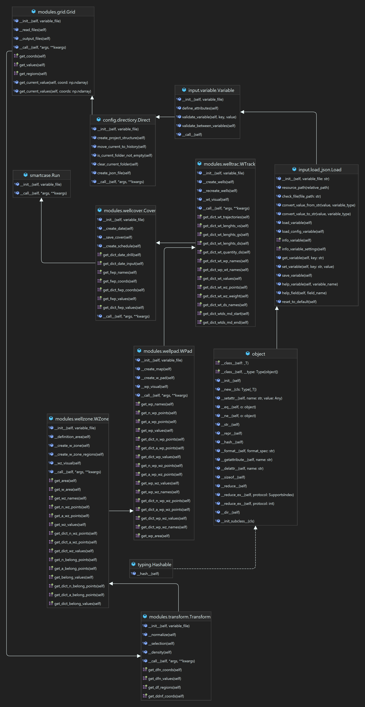

## Технологии
- kmeans & GMM кластеризация для выдления зон, кустов
- networkx  для проведения графовых расчетов для определения оптимальной проводки
- plotly для визуализации итогово расчета
  
## Пример использования скриптов
1. Определение кубов OIPM, GIPM, PERMX и сетки (данную работу выполянет full.py - Workflow tNavigator)
2. Данные выгруженные кубы путем преобразований по нормализации приводятся плотностному распределению и повдение свойства будут в дальнешем описывать точки 

Примеры итоговых целевых точек. Чем ярче точки, тем выше значение расчитанного свойства

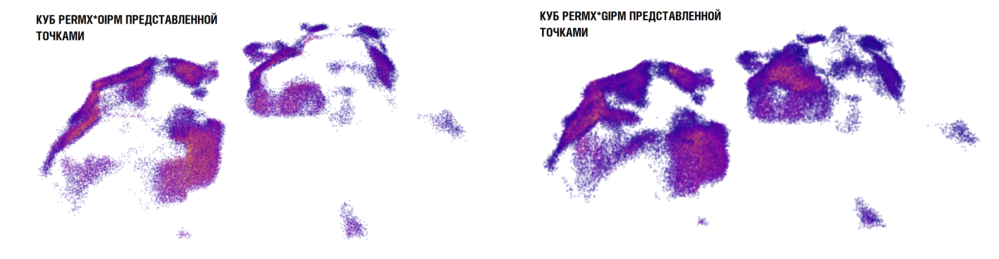

3. Точки с нормализованными координатами и свойствами PERMX * OIPM (для нефтяного кейса) и GIPM * PERMX (для газового кейса) используются в качестве исходной информации для
   выделения ранжированных зон путем использования кластериации Kmeans. Стоит отметить что пользователь в зависимости от ситуации может выбрать другие свойства, тут нет
   особых ограничений

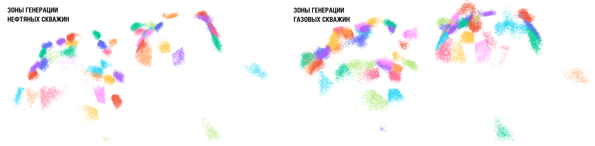

4. Центральные точки кластеров в данном случае зон используются для вторичной кластреизации Kmeans в целях выделения кустовых площадок.
   При определнии расположения кустов, если указан путь к растровому снимку поврехности месторождения, будут корректироваться.
   Тем самым будут исключаться ситуации возможного расположения кустовой площадки в реках, озерах и болотах.

Пример обработки .png или .jpeg  файла на предмет наличия водных объектов

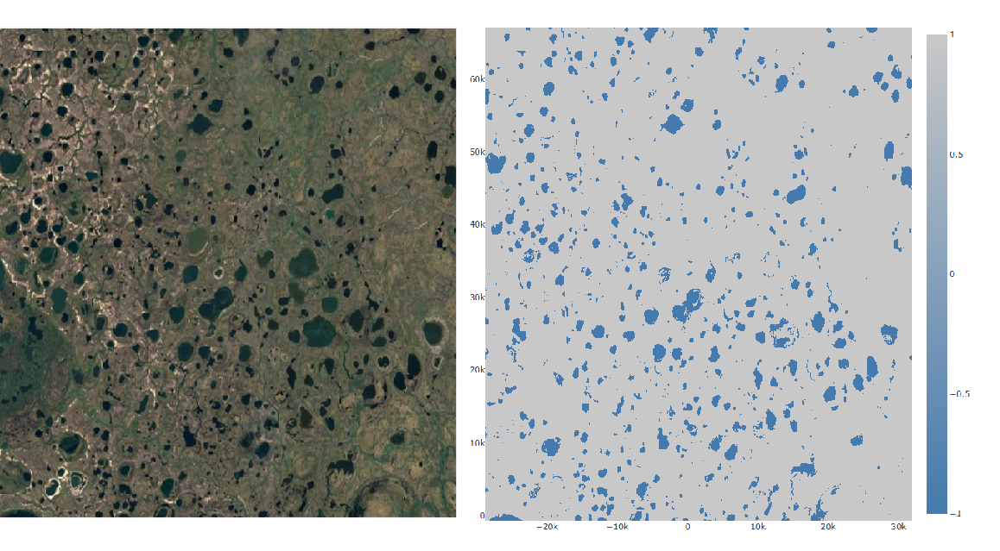

5. В дальнешйем путем использования графовых алгоритмов (алгоритм Дейкстеры, алгоритм Минимального остовного дерева - можно настроить),
   по рассматриваемиой зоне, выбираются опорные точки и линии связи с уcлоdной точкой T2 (T2 выбирается из условий буримости, углов)
   Дальше по каждому пути: [опорная точка (возмоная точка T3); линия; опорные точки; точка T2] производятся опперации сглаживания, интерполяции
   Производятся также расчеты углов, длин и расстояний, проверяются условия буримости стволов  

Пример по определению траектории скважины

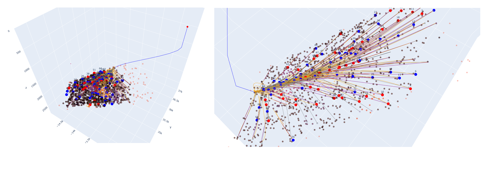

6. Итоговые результаты расчетов траектории представляются в виде файла welltrac.INC с шагом записи 10м. В итоге после расчетов тракетории производятся расчеты для графика
   ввода скважин в виде файлов gss.xlsm и sсhedulle.sch.

Пример визуализации скважин по отношению целевых точек. Исходя из неравного мастшатба по оси z. Траектории вытянуты и видны флуктуации, но так как неровности горизональных частей скважины представлены в диапазоне от 1 до 3 метров серьезной опасности это не несет. 

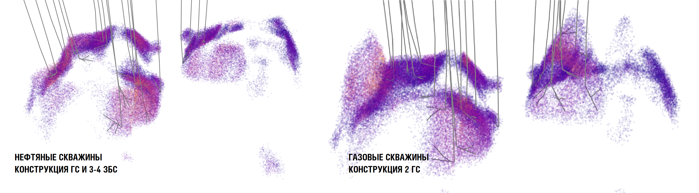

## Итоговое представление таректорий скважин в проекте tNavigator

Запасы нефти

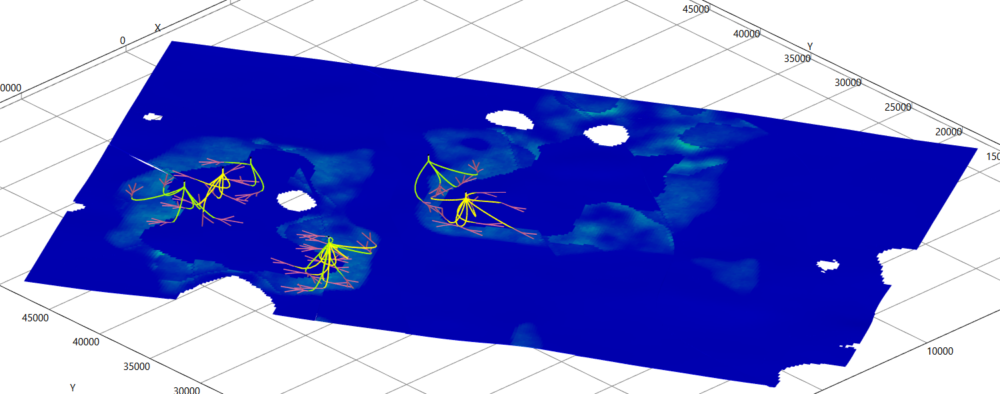

Запасы газа

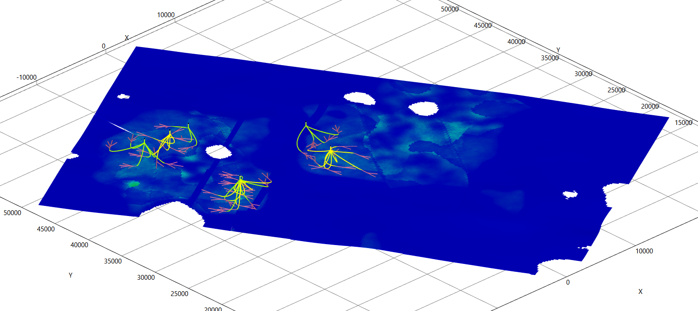

Условное обозначение:
- желтые линии - газовые скважины
- зеленые линии - нефтяные скважины
- розовые линии - перфорации

  
7. Резульатыт расчета по вышеописанному месторождению
   - [Материалы результатов расчета по примеру нефтяного кейса](https://drive.google.com/drive/folders/1Ta-AU0qcTslVdw6nYSHTIVCDJDtoED9e?usp=sharing)
   - [Материалы результатов расчета по примеру газового кейса](https://drive.google.com/drive/folders/1tw3A0A2y_fzMviKHpZmaCBPPzuY3rt2w?usp=sharing)
   
## Порядок действий с интеграции tNavigator

01. **Необходимо установить SmartCase c Google Drive**
   
03. **Необходимо установить templeate.py**
   
04. **Необходимо установить variable.json, default_variables.json, config_varibale.json**
   
05. **Импорт Workflow templeate.py в проект Дизайнера Моделей**
   
06. **Необходимо создать директорию coord_direcotory**
   
    - Директория coord_direcotory испольузется для хранения выгружаемой сетки.
    - Выполняется через команду WorkFlow - "09. Выгрузка сетки"
    - Абсолютный путь должен должен проходить кодировку UTF-8 (без русских букв)
   
8. **Необходимо создать директорию property_directory**
   
    - Директория property_directory испольузется для хранения эскпортируемых кубов свойств сетки
    - Выполняется через команду WorkFlow - "10. Сохранение кубов свойств"
    - Абсолютный путь должен должен проходить кодировку UTF-8 (без русских букв)
    
10. **Необходимо создать директорию project_directory**
    
    - Директория project_directory испольузется для хранения временных файлов результатов расчета
    - Внутри project_directory будут создаваться директории current и history
    - При повторных запусках содержимое директории current (результаты расчета после первого запуска) будет переносится в директорию history
    - Абсолютный путь должен должен проходить кодировку UTF-8 (без русских букв)
    
12. **Необходимо создать директорию region_directory**

    - Директория region_directory испольузется для хранения эскпортируемого дискретного куба регионов
    - Выполняется через команду WorkFlow - "10. Сохранение кубов свойств"
    - Данная директория должна содержать только один файл ".INC", в противном случае будет выбран первый файл
    - В случае отсутсвия куба регионов, необходимо оставить папку region_directory пустым
    - Абсолютный путь должен должен проходить кодировку UTF-8 (без русских букв)
    
14. **Необходимо создать директорию mask_directory**
    
    - Директория mask_directory испольузется для хранения эскпортируемого бинарного (0 и 1) куба фильтра
    - Выполняется через команду WorkFlow - "10. Сохранение кубов свойств"
    - Данная директория должна содержать только один файл ".INC", в противном случае будет выбран первый файл
    - В случае отсутсвия куба фильтра, необходимо оставить папку mask_directory пустым
    - Абсолютный путь должен должен проходить кодировку UTF-8 (без русских букв)
    
16. **Необходимо создать директорию map_directory**
    
    - Директория map_directory испольузется для хранения растровой карты ".png" или ".jpeg"
    - Выполняется через команду WorkFlow - "10. Сохранение кубов свойств"
    - Данная директория должна содержать только один файл ".png" или ".jpeg", в противном случае будет выбран первый файл
    - В случае отсутсвия растровой карты, необходимо оставить папку mask_directory пустым
    - Абсолютный путь должен должен проходить кодировку UTF-8 (без русских букв)

18. **Определение локальных переменных абсолютных путей к директориям и к файлам json**
    
    Выполняется через команду WorkFlow - "03. Пути к директориям" и "04. Пути к файлам json"
    
20. **Определение объекта классс Manager**
    
    - Выполняется через команду WorkFlow - "15. Определение переменных моделей"
    - Для оценочного запуска рекомендуется определить переменные: duration, start
    - Для оптимизационной задачи рекмендуется определить переменные: duration, start, selection, wp_max, wt_max, mobil_dr
    - Остальные переменные выставлены по умолчанию
    - default_variables.json - необходим для сброса установленных переменных
    - config_varibale.json - хранение ифнормации о переменных

Более подробная информация приведена в готовых WorkFlow templeate.py и в example.py

## Преимущества использования SmartCase.exe
При написании кода, я следовал к требованию к возможностям интеграции с регрессиоными моделями ML в целях ускороения поиска оптимальных вариантов по разработке, так как расчеты на ГДМ на полномастштабных моделях занимают высокий временной ресурс. Учитывая особенность предлагаемого подхода SmartCase.exe, удается использовать минимум признаков и задающих переменных в целях описания траекторий скважин. И из-за этого оперативно быстро собирать результаты расчета и проводить различные работы
Ниже представлен примеры реализации такого подхода на примере нефтегазоконденсатного месторождения.

Концептуальная схема использования расчетов с ипользованием ML, в целях ускорения расчетов при решении глобальных задач

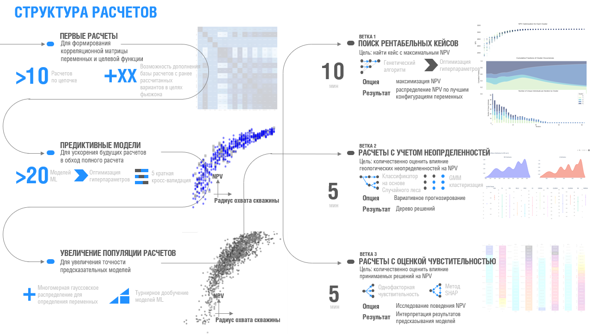

Подход требует выполнения следующих шагов:
1. Формирование пула расчетов в целях с ипользованием методов планирования экспериментов (доступно в tNavigator)
2. Подлкючение ML Regressor c автотюнингом гиперпараметров. На данном этапе реализованы возможности использования:
   - Linear Regression 
   - K-Nearest Neighbors
   - Gradient Boosting
   - Lasso Regression
   - Ridge Regression
   - Elastic Net Regression
   - Bayesian Ridge Regression
   - Stochastic Gradient Descent (SGD) Regressor
   - Decision Tree Regressor
   - Extra Trees Regressor
   - AdaBoost Regressor
   - Bagging Regressor
   - XGBoost Regressor
   - LightGBM Regressor
   - Gaussian Process Regressor
   - Random Forest
   
   Харакетристики обученной ML XGBoost Regressor модели

   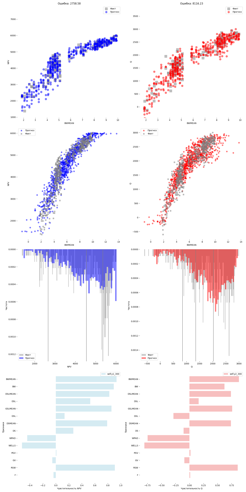

4. Определение корреляционной матрицы, для генерации новых данных в целях

   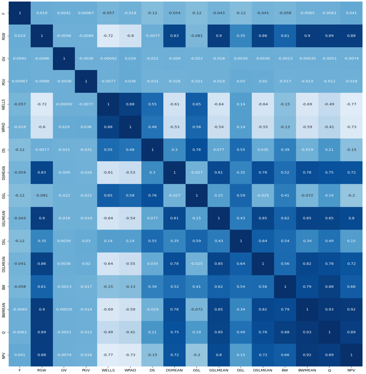

   
5. Формирование пула синтетических расчтетов расчетов
6. Генетическая оптимизация

   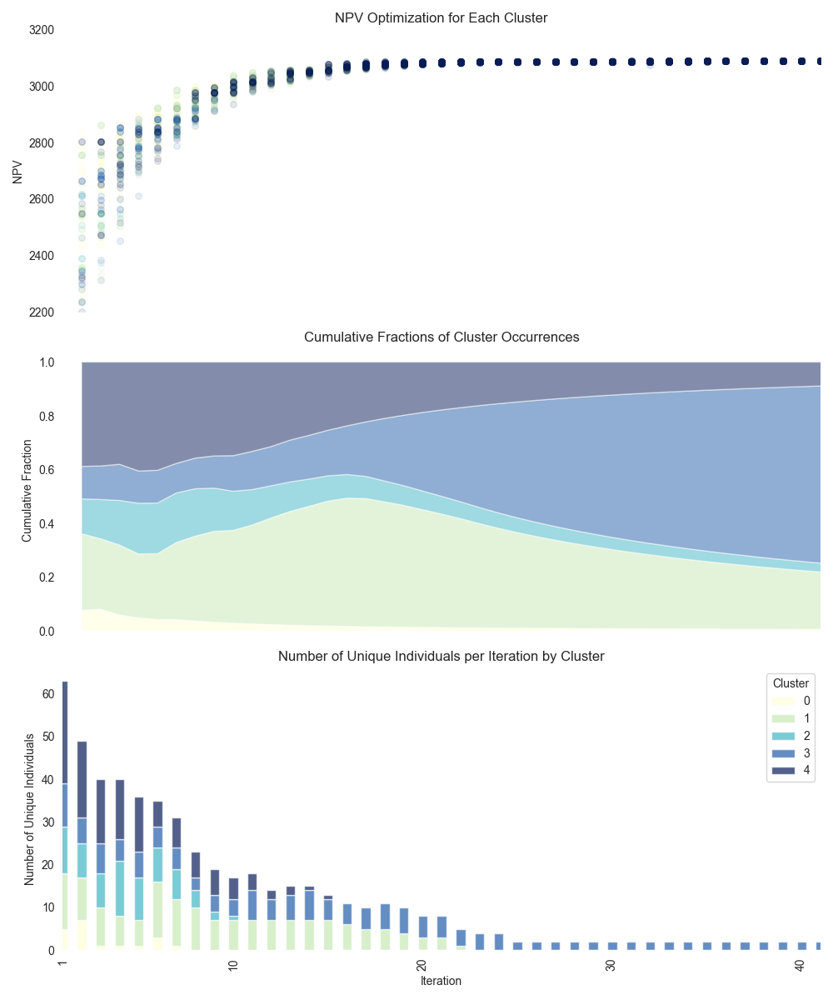

   
7. Анализ чувстительности - PDP анализ

   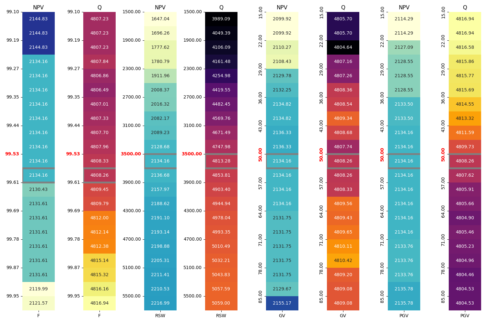
   

8. Расчет устойчивости

   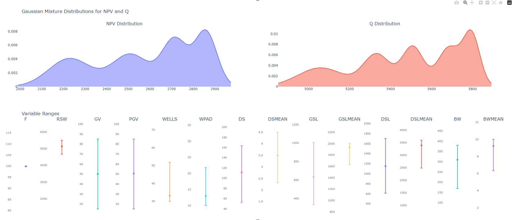

   
9. Сравнительный анализ базовых решений и решений сгенерированных  с использованием SmartCase.exe

    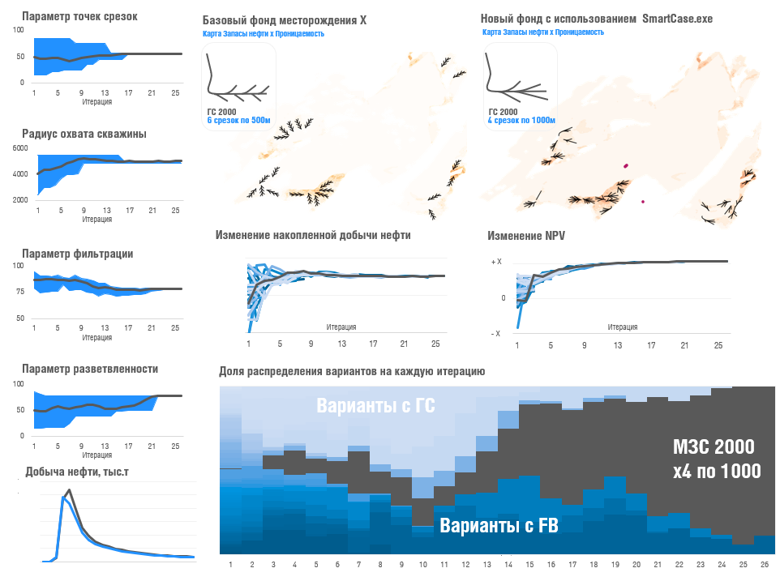
    

## Контакты
Если возникнут сложности в интеграции представленных выше решений, прошу связаться:)
Александров Николай - Aleksandrov.NA@yahoo.com - https://github.com/Nikolaytreyd
