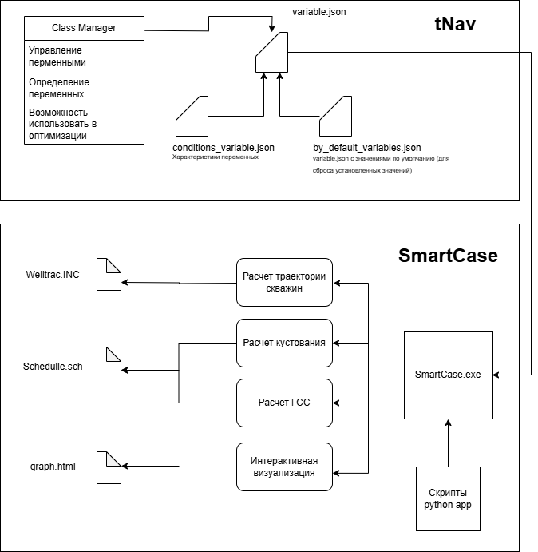
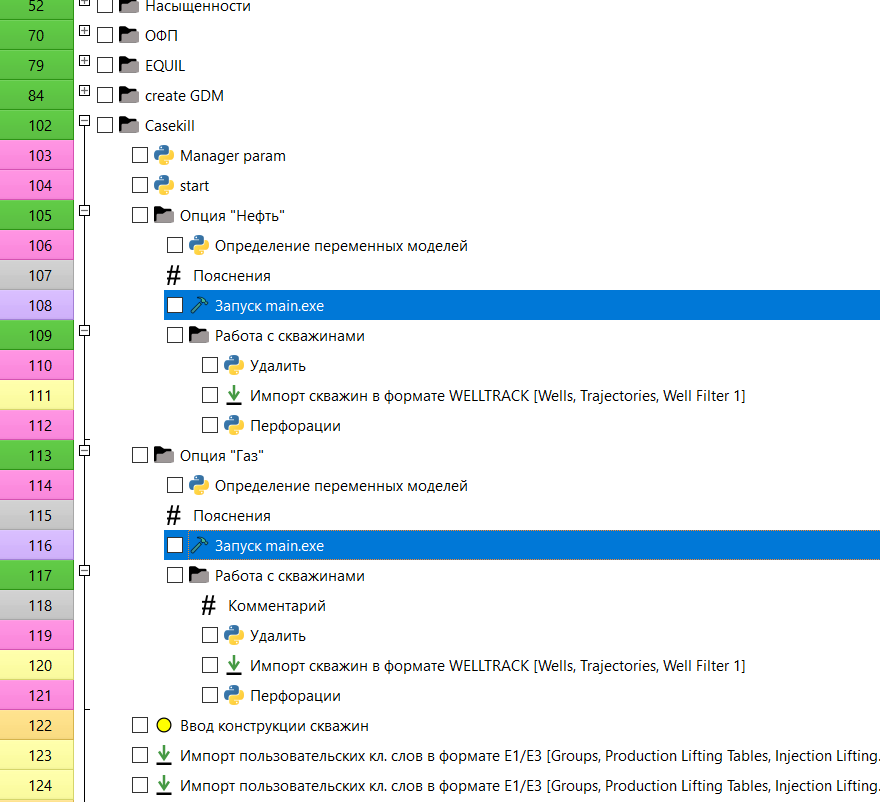
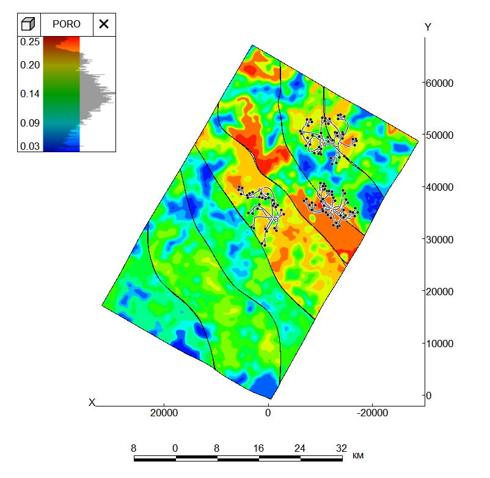
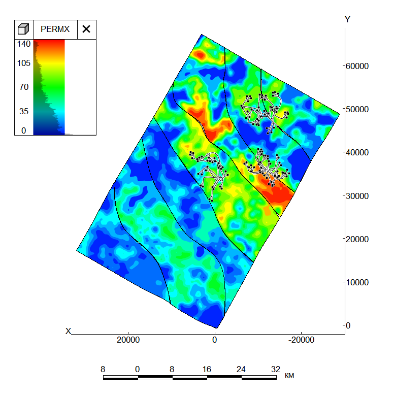
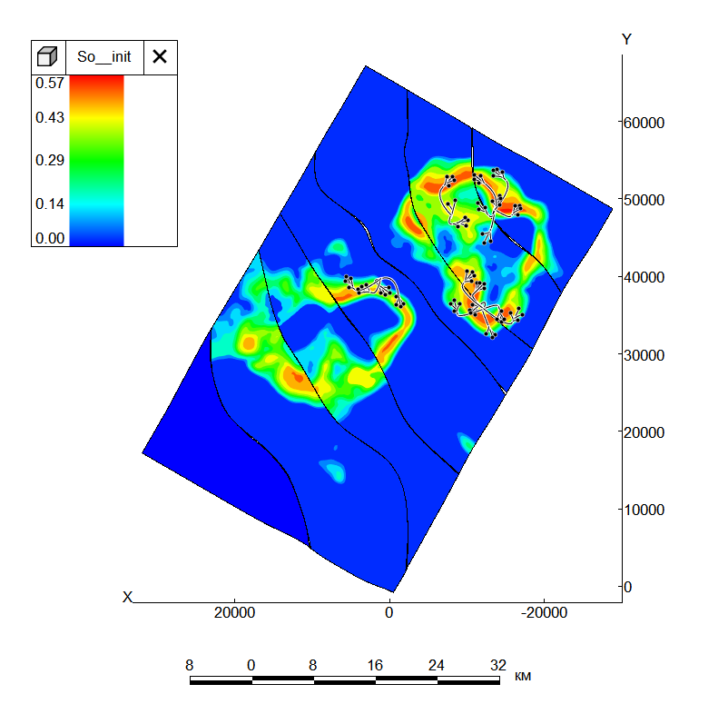
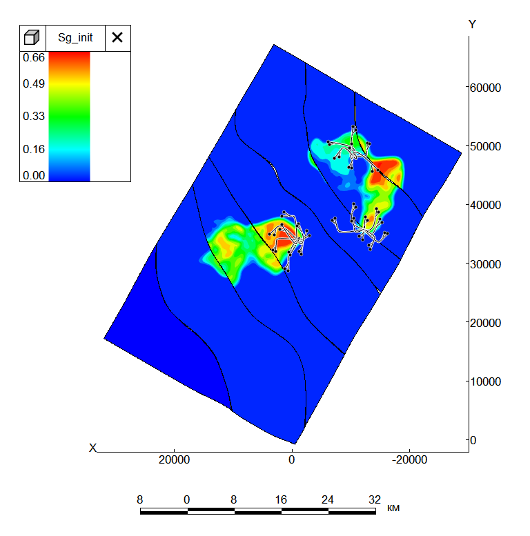

## Проект Workflow приведен в качестве примера, для формирования понимания как серия скриптов smartcase python интегрируется в проект Дизайнер Моделей

Блок-схема взиамодейсвтия tNavogator и SmartCase.exe 

Представление в Workflow tNvaigator

## Описание Workflow
В качестве примера приведены карты пористоти и проницаемости, генерируемые с ипользованием алгоритма непрерывного моделирования пещеристых тел

Карта пористости

Карта проницаемости

1. В целях усорения расчетов было принято решение использовать Correy корреляцию для форимрования таблиц ОФП: SWOF и SGOF
2. Аналогичным подходом происходит определение PVTO (летучая нефть), PVTG (сухой газ) по эмпирическим корреляциям 
3. Используя J-функцию и кубы капилярных кривых были построены кубы начальной нефтенасыщщености, газонасыщщености и водонасыщенности

   
Карта нефтенасыщенности, с генерированным нефтяным фондом скважин

Карта газонасыщеннсоти,с генерированным газовым фондом скважин

   
